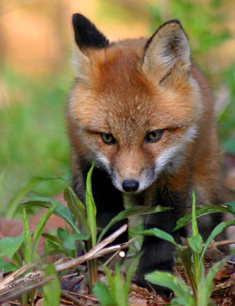
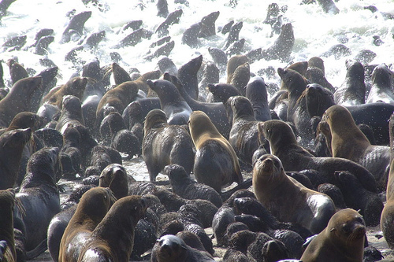
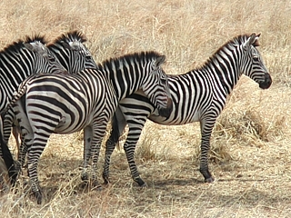
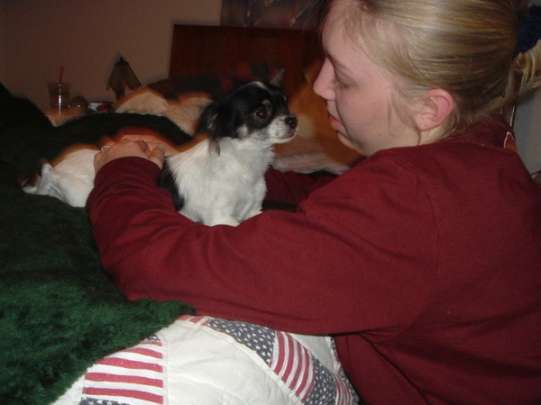
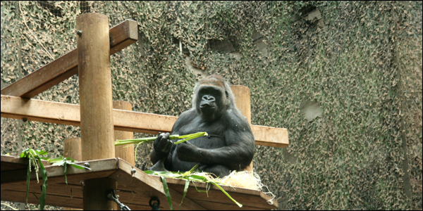
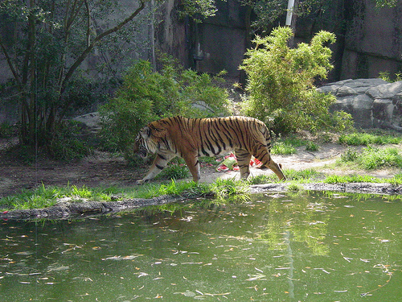
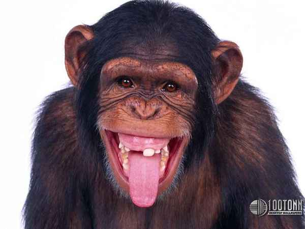
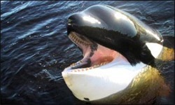
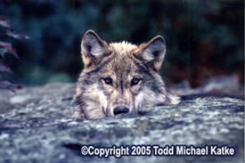

# Aren't we all axolotls
The goal of the project: Automatically classify images of animals.
In this project, you are given 1000 train images and 200 validation images from 10 animal categories. Using these images, the goal is to correctly classify 500 test images.
The 10 animal categories: "blue whale", "chihuahua", "chimpanzee", "fox", "gorilla", "killer whale", "seal", "tiger", "wolf", zebra". 

Pipeline system for animal classification, for more info see http://attributes.kyb.tuebingen.mpg.de/.

